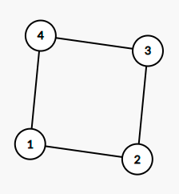
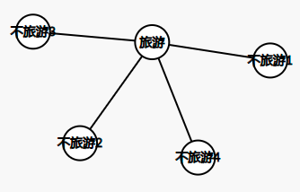
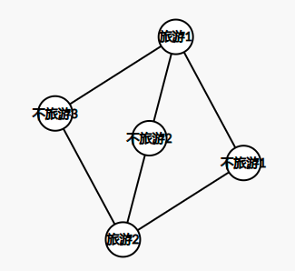
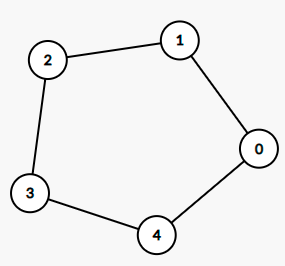
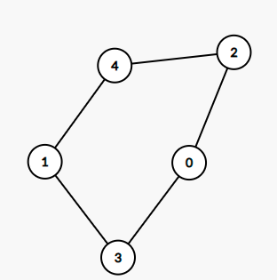

## 第三次图论作业  201220183 王宇鸣

- 3.4 

  仍然是最简系统，每个设备看成一个点，两个设备之间有线缆看做两个点之间有一条边。

  问题转化为，一个图，任意两点之间有且仅有一条迹，问删掉所有的度为1的点之后是否还有这样的性质

  原图任意两点（非终端点）之间都有一条迹，而这条迹不可能经过度为1的点，因为如果经过这个度为1的点（终端），一定将与这个终端相连的那条边走了两遍，那这就不是一条迹。也就是原来存在的迹（起始点不是终端的），现在仍然存在。而显然不可能因为删掉点，增加出原来不存在的迹，因为没有增加过边，新图中的迹，在原图中一定都存在。

- 3.5

  不一定，举例

  

​		这四个点里面没有终端，任一点的与之跳数最远的设备都不是一台终端

- 3.12

  可能

  四个城市分别是旅游不粮食，粮食不旅游，旅游又粮食，不粮食又不旅游，如

  

- 3.13

  不可能

  五个点，分别可以是旅游或者不旅游，一共有四种情况，能形成两种不同的图

  

（其他两种情况和上面两种情况虽然旅游城市数量不一样，但是形成的旅游边的情况是完全一样的）

这两种图，分别能带来4，6条边，能让城市的度的数量增加（1，1，1，1，4）（2，2，2，3，3）

首先粮食和旅游都选择增加四条边的情况肯定是不行的，因为5个点的完全图有10条边，4+4<8，连边的数量都凑不齐

那么，就必须粮食或者旅游选择6条边的分布，不妨设有三个不旅游城市，两个旅游城市，然后像上面图那样排列，对于不旅游123三座城市，这三个城市之间任意两座城市不相连，也就是说粮食边要让他们三个相连，也就是说需要这三个城市的粮食资源状态各不相同，显然这是无法做到的，综上所述，5个城市是不可能存在这种情况的。

- 3.24

  5个

  

点数不足5的时候显然是不行的，因为一个点与两个点相连，这个点在两次相连的点不一样，所以至少得1+2+2=5个点才可能达到要求