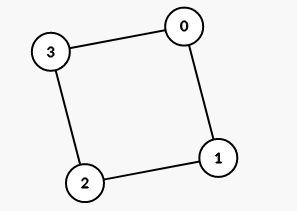
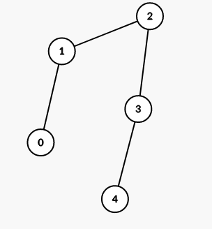
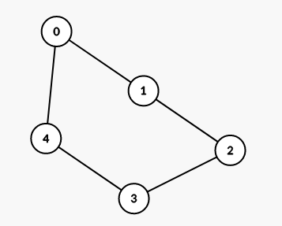
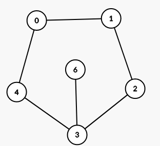
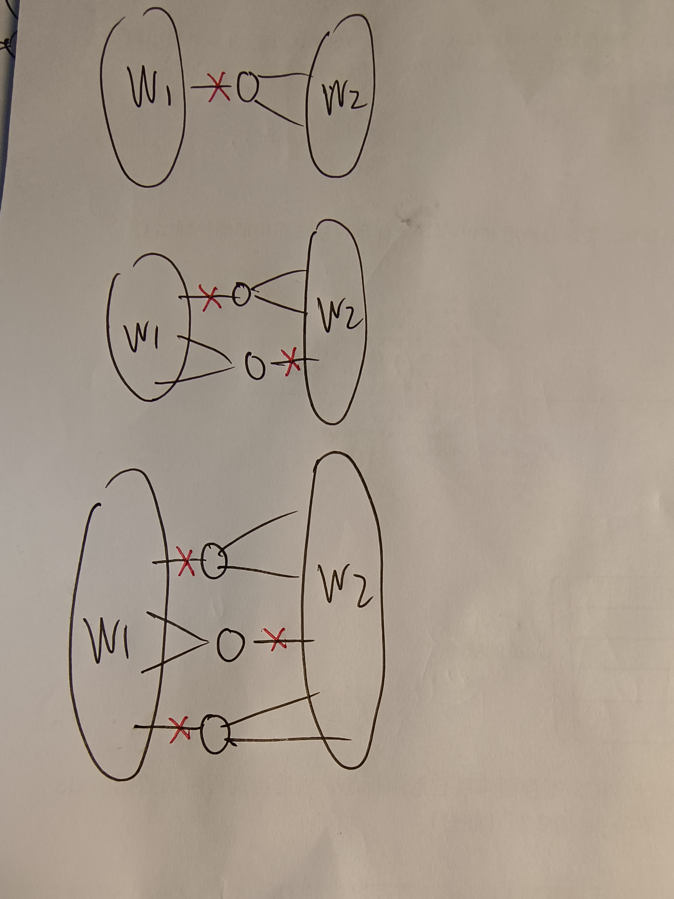

## 201220183王宇鸣第四章图论作业

- 4.1

  根据题意，每个航空公司都是一个极大联通子图，也就是一个块，原图有k个块，题目转化成：已知图有k个块，和k个块的城市数量，求城市的总数量

  但是， 总的城市数量是不能得出的

  例如

  

  

  这两个图k序列都是（2，2，2，2），但是城市数量不同

- 4.3

  树是极小连通图，极大无圈图，有n-1条边

  每个城市两条航线，总度为2n-2，有n条边，图中有一个圈

  两种情况

  - 所有的点都在圈上，显然此时l=2,p=2

    

  - 不是所有的点都在圈上

    不在圈上的点u和圈上的点v相连，那么v是割点，（u，v）是割边，此时l=1,d=1

    

  综上，此时城市容错系数=航线容错系数

- 4.4

  还是相等，ｌ＝ｐ

  

  - W1,W2对应两个连通分量，中间的代表割点，割点一定使一条边与一个连通分量相连，另两条边与另外一个连通分量相连，删掉所有的割点与连通分量一条边相连的点，图一定不连通
  - 上面我们证明了，在本题的环境下，删去点连通分量数量的边一定能让图不连通，即边连通分量一定小于等于点连通分量，那么我们还有定理`点连通分量小于边联通分量`，所以我们知道，在本题中，点连通分量=边连通分量。

- 4.5

  还是p

  把和这个新加的点相连的p个点都删掉就不连通了

- 4.6

  有可能

​		对于边连通度来说，如果删掉的边属于边割集则`l=l-1`否者`l=l`

​		对于点连通度来说，根据门格尔定理，原来任意两个顶点之间存在至少ｋ条两两无公共内顶点的路，如果删掉一条边之后使莫两个点之间的两两无公共内顶点的路减少到了ｋ－１条，那么点连通度使会－１的，当然也有可能不变，但是不可能更多，因为不可能破坏掉两条不同的（ｕ，ｖ）之间的两两无公共内顶点路
