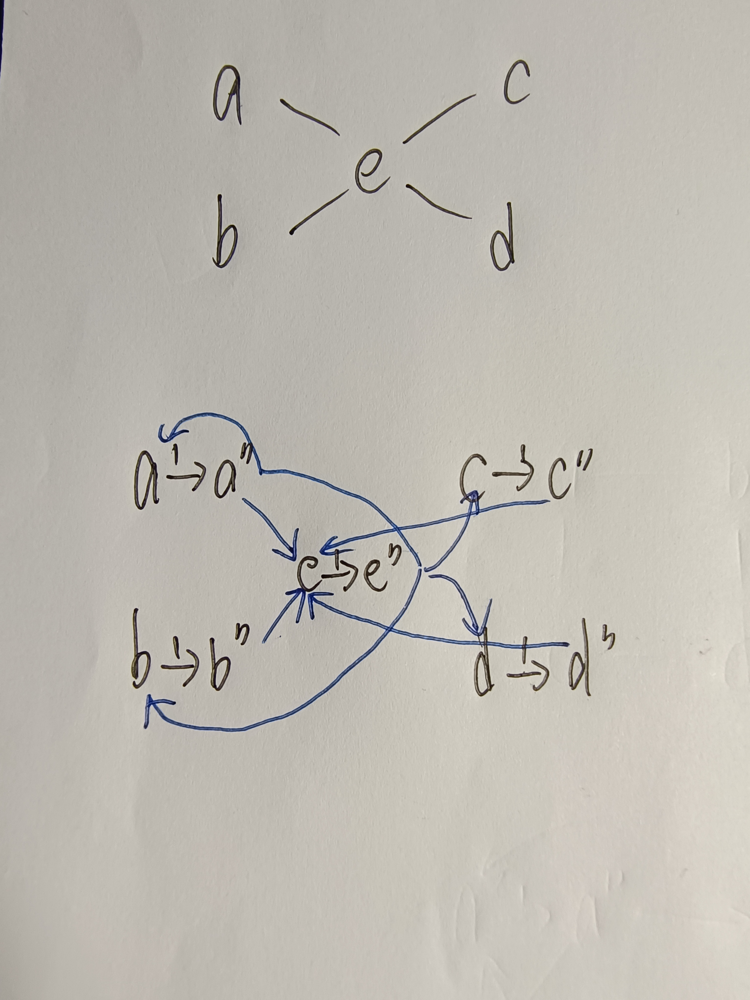

## 201220183 王宇鸣 图论作业

#### 将二分图最大匹配问题归约为最大流问题

将已有的边的容量设为无穷大的正向边，增加一个s点一个t点，s与V1中所有点相连，t与V2中所有点相连，新加的这些点的容量都设为1，那么计算得到的最大流就对应二分图的最大匹配（容量为1的弧就是匹配中的边）

证明：匹配中边的数量=流的流量，如果我们得到的不是最大匹配那么得到的也一定不是最大流

####  将边连通度计算问题归约为最大流问题

对于图G，设u，v是图G上的两个顶点。要想让u,v之间没有通路，至少需要删除x条边。这个x可以通过最大流求得：以u为源点，v是汇点，边容量均为1，那么计算出最大流，也就是最小割就等于x。

但是这个x不一定是边连通度，边割集将图分为两个集合，uv如果在不同集合中，那么这个x就是边连通度，如果在相同集合中，这个x就不是。那么我们最终的算法是：任选一个u，遍历所有的其他点（一定有点和u被边割集分割在不同的集合中），按上述算法求最大流，求出的所有最大流的最小值就是这个图的边连通度。

#### 将点连通度计算问题归约为最大流问题

思路：
要求点连通度，需要转换为求边连通度，这需要我们构造一个网络，让他的边连通度等于原图的点连通度

若G为无向图：

1. 原 G 图中的每个顶点 v 变成 N 网中的两个顶点 v' 和 v" ，顶点 v' 至 v" 有一条弧（有向边）连接，弧容量为 1;
2.  原 G 图中的每条边 e ＝ uv ，在 N 网中有两条弧 e’= u"v',e"=v"u' 与之对应， e' 弧容量为 ∞ ， e" 弧容量为 ∞

若 G 为有向图：

1. 原 G 图中的每个顶点变成 N 网中的两个顶点 v’ 和 v” ，顶点 v' 至 v” 有一条弧连接，弧容量为 1
2. 原 G 图中的每条弧 e ＝ uv 变成一条有向轨 u'u"v'v" ，其中轨上的弧 u"v' 的容量为 ∞;

构造好网络之后，任选一个u"（拆分后的后点）作为源点，遍历所有的v‘（拆分后的前点）作为汇点，求最大流，所有的最大流的最小值就是图的点连通度。

举例：

把原图中一个点分成两个点，中间再加一条边，把找割点的问题转化为了找割边的问题