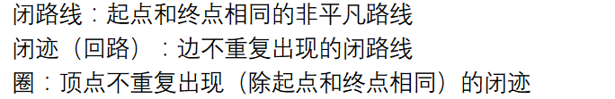
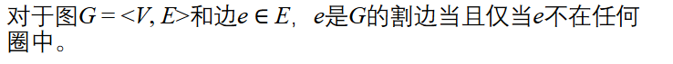
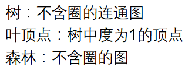
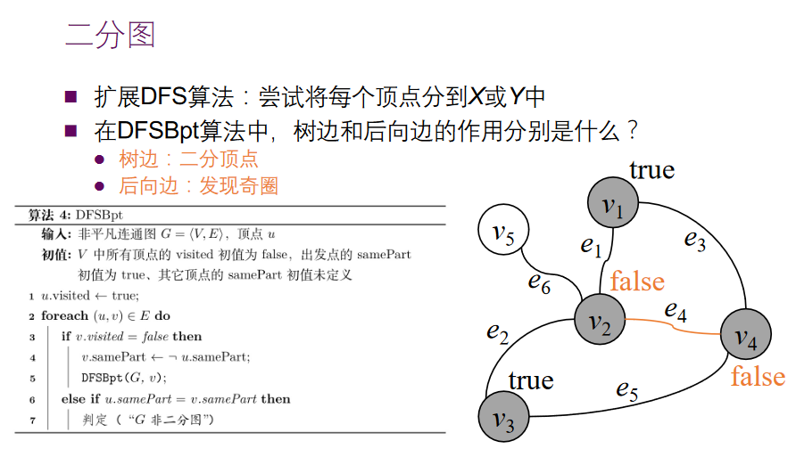
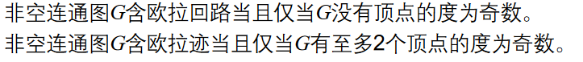
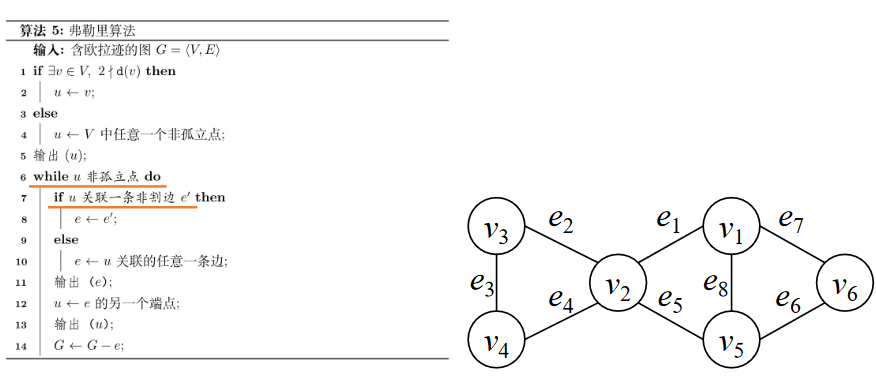
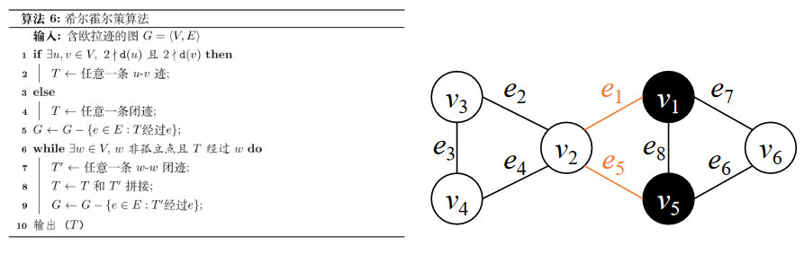
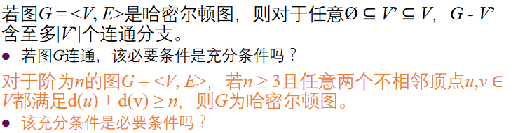

## 圈和树

### 割边的等价定义

**在图论里面，度为1的就是叶子，比如两个点的树有两个叶子而不是一个根节点和一个叶子**

## 二分图

平凡图不是二分图，因为**划分**的定义是**划分成交集为空集并集为全集的若干非空子集**

完全图不是二分图，K1不是

### 判断图是否是二分图的算法

还是比较简单的，后向边的两个端点如果samepart就不是二分图

## 欧拉回路

含有欧拉迹的图不一定连通

### 找出欧拉迹的两种算法

#### 弗勒里算法

- 出发点：有奇度顶点的话就选之，没有任选
- 有限选择非割边
- 删掉走过的边
- 重新计算割边

时间复杂度很高

#### 希尔霍尔策算法

时间复杂度O（n+m）

- 如果有两个顶点的度为奇数，那就选择链接这两个顶点的任意一条迹T
- 然后从这条迹上选择任意一个点，选择他的闭迹和T‘与T相连，知道没有边在T之外

## 哈密尔顿图

